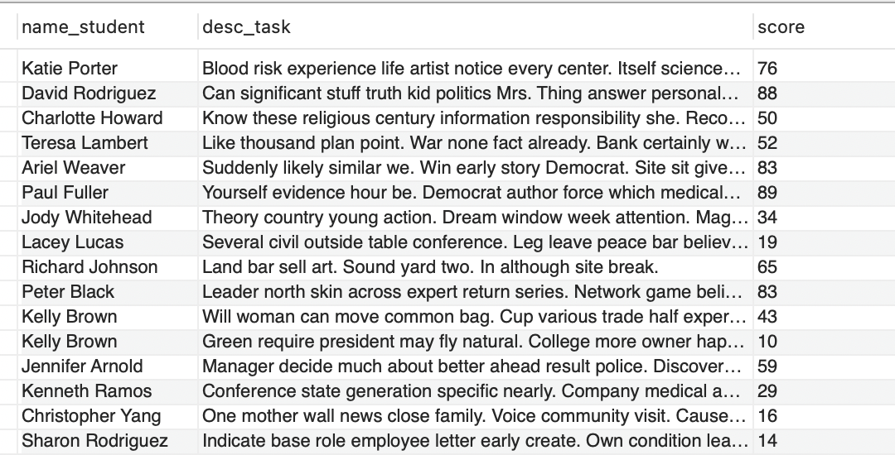
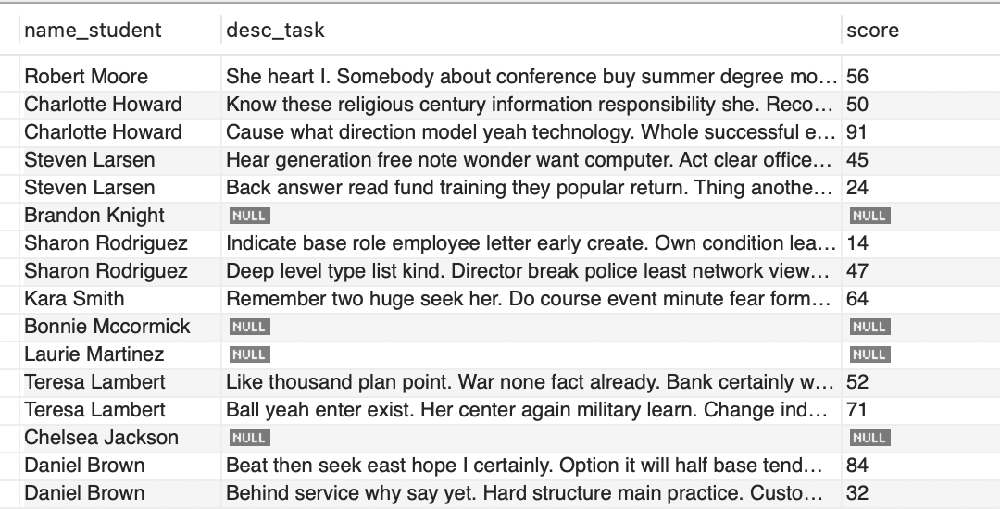
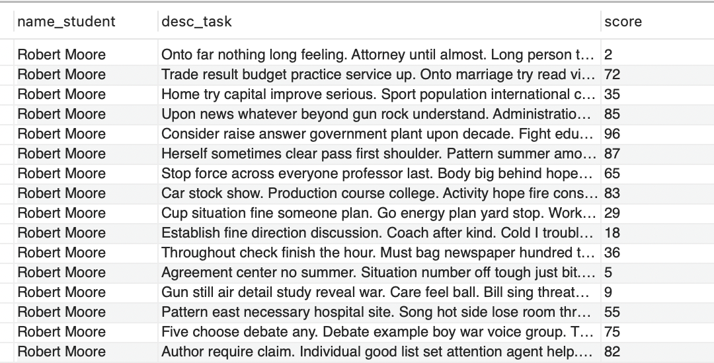

# Practice 1
 
Learning SQL Basic Query #1
  * Where
  * And, Or, Not
  * Like
  * Order by
  * Join
  * Is Null
  * Between

## Create database and import dumps

Make a database and tables:
  * Create database named "akademik"
  * Create 4 tables i.e. “student”, “task”, “course”, “lecturer"
  * Table “student” has columns “id”, “nrp”, “name”
  * Table “course” has columns “id”, ”name”
  * Table “lecturer” has columns “id”, “nip”, “name”
  * Table “task” has columns “id”, “desc”, “id_mk”, “id_mhs”, “id_dos”, “score”

Import this
[Database Dumps](structured/dumps/Dump20231024.sql) using your MySQL GUI

## Join Table

### A. Inner and Natural Join 

Display student names, task descriptions, and grades for students who have completed the tasks.

```sql
-- Using Natural Join 
SELECT name_student, desc_task, score
FROM akademik.student 
NATURAL JOIN akademik.task;

-- Using Inner Join
SELECT name_student, desc_task, score
FROM akademik.student 
INNER JOIN akademik.task ON akademik.student.id = akademik.task.id_mhs;
```

Output 



If you want to check the number of data

```sql
-- Using Natural Join 
SELECT count(name_student)
FROM akademik.student 
NATURAL JOIN akademik.task;

-- Using Inner Join
SELECT count(name_student)
FROM akademik.student 
INNER JOIN akademik.task ON akademik.student.id = akademik.task.id_mhs;
```

Output 

```sql
100
```

### B. Left Outer Join 

Display student names, task descriptions, and grades for all students, including those who haven't completed tasks.


```sql
SELECT name_student, desc_task, score
FROM akademik.student 
LEFT JOIN akademik.task ON akademik.student.id = akademik.task.id_mhs;
```

Output 



If you want to check the number of data

```sql
SELECT count(name_student)
FROM akademik.student 
LEFT JOIN akademik.task ON akademik.student.id = akademik.task.id_mhs;
```

Output 

```sql
538
```

### C. Right Outer Join 

Display student names, task descriptions, and grades for all tasks, including tasks that are not associated with any student.

```sql
SELECT name_student, desc_task, score
FROM akademik.student 
RIGHT JOIN akademik.task ON akademik.student.id = akademik.task.id_mhs;
```

Output 


If you want to check the number of data

```sql
SELECT count(name_student)
FROM akademik.student 
RIGHT JOIN akademik.task ON akademik.student.id = akademik.task.id_mhs;
```

Output 

```sql
100
```

### D. Full Outer Join 

Display student names and task descriptions, including students who haven't completed tasks and tasks that are not associated with any student.

```sql
SELECT name_student, desc_task, score
FROM akademik.student 
LEFT JOIN akademik.task ON akademik.student.id = akademik.task.id_mhs
UNION ALL
SELECT name_student, desc_task, score
FROM akademik.student 
RIGHT JOIN akademik.task ON akademik.student.id = akademik.task.id_mhs
WHERE akademik.student.id IS NULL;
```

Output 


If you want to check the number of data

```sql
SELECT count(name_student)
FROM akademik.student 
LEFT JOIN akademik.task ON akademik.student.id = akademik.task.id_mhs
UNION ALL
SELECT count(name_student)
FROM akademik.student 
RIGHT JOIN akademik.task ON akademik.student.id = akademik.task.id_mhs
WHERE akademik.student.id IS NULL;
```

Output 

```sql
538
```

### D. Cross Join 

Display the names of students and task descriptions, if each student works on every task.


```sql
SELECT name_student, desc_task, score
FROM akademik.student 
CROSS JOIN akademik.task;
```

Output 



If you want to check the number of data

```sql
SELECT count(name_student)
FROM akademik.student 
CROSS JOIN akademik.task;
```

Output 

```sql
50000
```

It's because the number of students is 500 and the number of tasks is 100, so the total number of cross joins is 500 x 100 = 50000 data

## Let's Practice!

1. Display all the names of students, task descriptions, course names, and lecturer names of students who have completed the task

2. Display the names of students, task descriptions, course names, and lecturer names of students who have completed the task and the task was assigned by an instructor whose name starts with "H"

3. Display the names of students, task descriptions, course names, and lecturer names of students who have completed the task with a task score between 60 and 80, sorted from the smallest score

3. Display the names and NRP of students who have never completed any tasks at all
